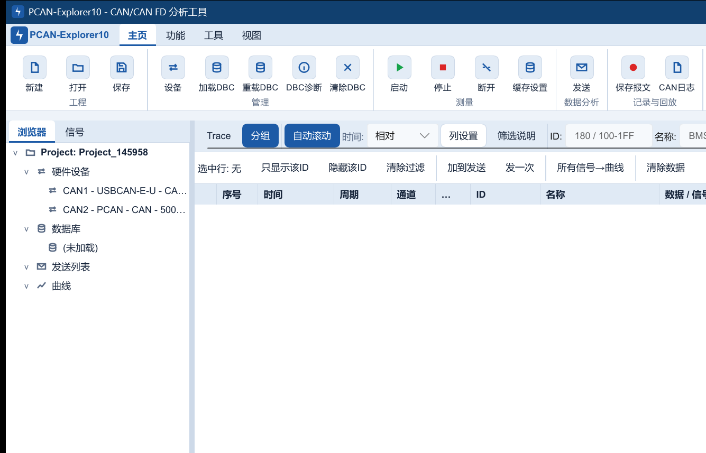

# PCAN-Explorer10 v0.7.1

**Windows CAN / CAN FD 工程分析平台**

面向汽车电子、储能、充电设备与工业通信研发测试，覆盖多厂商硬件接入、DBC 解析、报文采集与发送、记录回放、实时曲线、可视化仿真、printf-over-CAN、Modbus 与串口调试。

[GitHub 下载 v0.7.1](https://github.com/mycode2025-ui/PCAN-Explorer10/releases/download/v0.7.1/PCAN-Explorer10-Setup-0.7.1.exe) · [Gitee 下载 v0.7.1](https://gitee.com/mycode2025-ui/PCAN-Explorer10/releases/download/v0.7.1/PCAN-Explorer10-Setup-0.7.1.exe) · [官方网站与版本说明](https://www.hexbyte.cn/#release)

## v0.7.1 更新

- 重构运行诊断面板，实时展示界面、队列、硬件、记录与时间戳质量指标。
- 统一诊断弹窗和升级提示的圆角、间距、按钮布局与过渡反馈。
- 将运行诊断固定在状态栏最右侧，修正强调竖条与圆角边框越界。
- 适配 Rust 1.95 发布静态检查规则。

## 核心能力

- **多厂商 CAN / CAN FD**：PCAN（PEAK）、ZLG、ZHCX、GCAN 的设备扫描、通道配置和报文收发。
- **DBC 完整数值语义**：Unsigned、Signed、IEEE Float、IEEE Double，Intel / Motorola 字节序，factor、offset、单位和范围。
- **分析与记录**：16 列报文表、过滤、分组、变化高亮、实时曲线、CSV / ASC / BLF 记录与回放。
- **发送与仿真**：单次/周期发送、发送列表、可视化仿真工作区和 DBC 信号联动。
- **嵌入式调试**：printf-over-CAN 文本日志、UDS / XCP 工具入口。
- **Modbus Tools**：Modbus TCP / RTU 主站、从站仿真、寄存器视图、事件和流量监控。
- **Serial Tool**：普通串口调试、ANSI 交互终端、多行粘贴、文件和定时发送。

## 下载与校验

- 版本：`0.7.1`
- 安装包：`PCAN-Explorer10-Setup-0.7.1.exe`
- 大小：`30,642,307` 字节
- SHA-256：`508F3506C1F6F38E79973D2184DE958A8892C6479E8A84A301CA1A4022224A93`
- 系统：Windows 10/11 64 位
- 签名状态：当前安装包未进行 Authenticode 代码签名；构建脚本已生成内部完整性签名
- 发布验证：格式化、CAN / Serial / Modbus 三套 Slint 语法、UI 渲染矩阵、工作区测试和零警告 Clippy 审计均通过

真实 CAN/CAN FD 报文采集和发送需要兼容硬件及相应厂商驱动。工程、DBC、界面与配置等非总线功能可独立打开使用；当前版本不提供虚拟 CAN 总线。
